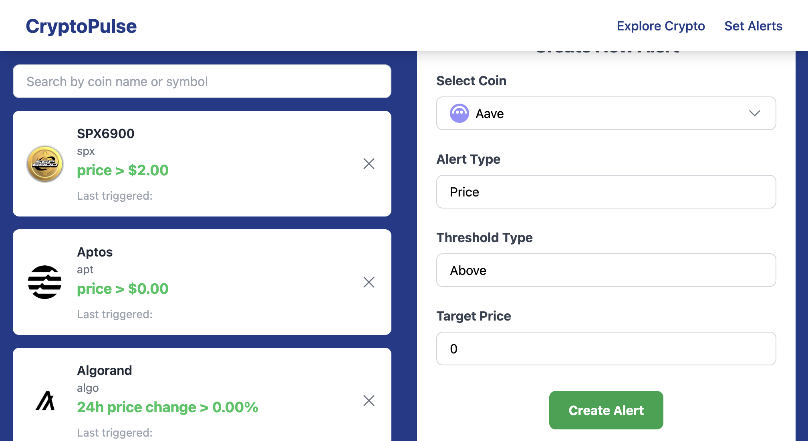

<!-- PROJECT LOGO -->
 

  

  
 
    Full-stack ecommerce web app built from scrtach with  
    React, Tailwind CSS, Express.js, PostgresSQL, Docker
     
     
  <a href="https://ebuyx.onrender.com">
    Project deployed on render >>
  </a>
  

## Project Highlight

- realtime streaming of crypto data from CoinGecko API using Kafka producer and consumer nodes
- fully scalable microservice architecture
- AWS S3 to archive price and volume data and display in interactive charts
- Firebase Realtime database to synchronize API data in crypto list every 10 seconds
- PostGresSQL ORM for storing OAuth user data and alert data
- automated CI/CD pipeline using Docker and Github Actions
- RabbitMQ to store triggered alerts in queue structure
- Firebase Cloud Messaging to process triggered alerts and push notification to client's browser

## Features

- Landing

  

- Explore Crypto
  - list of all cryptos with price and 24h percentage change
  - work flow: kafka produce api data from coinGecko API and publish to topic, consumer process data and store result to firebase. Frontend reads data from firebase

  
   
   
   

- Crypto Detail
  - interactive chart of price and volume data
  - work flow: kafka consumer stores price and volume data to AWS-S3, frontend fetch data and display them in charts

  
   

- Authentication
  - OAuth2 Login through google/github 
  - work flow: retrieve access token through OAuth API -> get auth token -> get user payload -> store in database

  

     
  

- Set Alerts
  - (once user is logged in) add custom alert when price/% exceeds user-defined threshold
  - push alert to browser using Firebase Cloud Messaging when condition is met 
  - workflow: kafka consumer detects alert triggers -> store to rabbitMQ -> read queue in notification service and send to FCM for display

  

## Fix Log

## Side Notes
